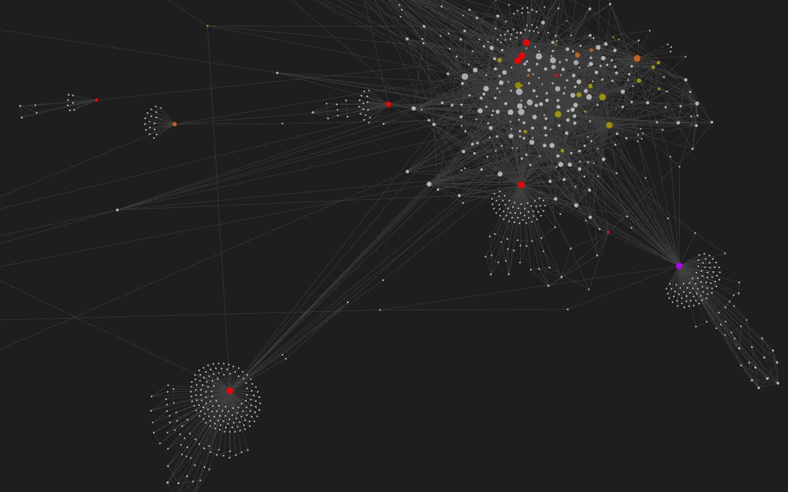

# BloxFinder

**BloxFinder** is a crawler designed to investigate criminal networks on the Roblox platform.



## Table of Contents
1. [Setup](#setup)
    - [BloxFinder Setup](#bloxfinder-setup)
    - [Obsidian Setup](#obsidian-setup)
2. [Usage](#usage)
    - [Crawling](#crawling)
    - [Analyzing](#analyzing)
3. [License](#license)

## Setup

### BloxFinder Setup

Before using **BloxFinder**, ensure you have **PHP 8.4** installed on your system. Follow these steps to install PHP 8.4 on a Linux-based system:

1. Install necessary dependencies:
    ```bash
    sudo apt-get install software-properties-common
    ```

2. Add the repository for PHP 8.4:
    ```bash
    sudo add-apt-repository ppa:ondrej/php
    ```

3. Update your package list:
    ```bash
    sudo apt-get update
    ```

4. Install PHP 8.4:
    ```bash
    sudo apt-get install php8.4
    ```

### Obsidian Setup

**Obsidian** is used to analyze the data collected by BloxFinder. To install it:

1. Download and install Obsidian from [the official website](https://obsidian.md/).
2. Once installed, you can open the vault generated by BloxFinder for analysis.
3. You can customize **group colors** for tags in Obsidian's graph settings to enhance visualization.

## Usage

### Crawling

To start crawling on a Linux device, use the following command in a terminal:

```bash
./run.sh <users_file_path> <output_directory>
```

`<users_file_path>`: Path to a text file containing one user ID per line.
`<output_directory>`: Directory where the collected data will be stored. **Tip:** For better analysis, use an empty directory to avoid cluttering Obsidian with unrelated files.

### Analyzing

Open the output folder with **Obsidian**.

You can view the relations of all the users in the `Graph` section. If you want more information about an user, search the user ID in the search bar or directly click on the dot representing the user you are interested in.

The software downloads the data from the user specified and its friends. The friends of their friend are listed but their data is not saved. If you want to display them in the graph, set the value of `Existing files only` to false.

1. Open the output directory with Obsidian.
2. View user relationships in the Graph section.
3. Search for a specific user by ID using the search bar or clicking on their graph node.
4. The software retrieves data from the target user and their friends. Friends of friends are listed but not fully stored. To display them in the graph, disable "Display existing files only" in Obsidian settings.

## License

BloxFinder is released under the MIT License.
See the `LICENSE` file for more details.
